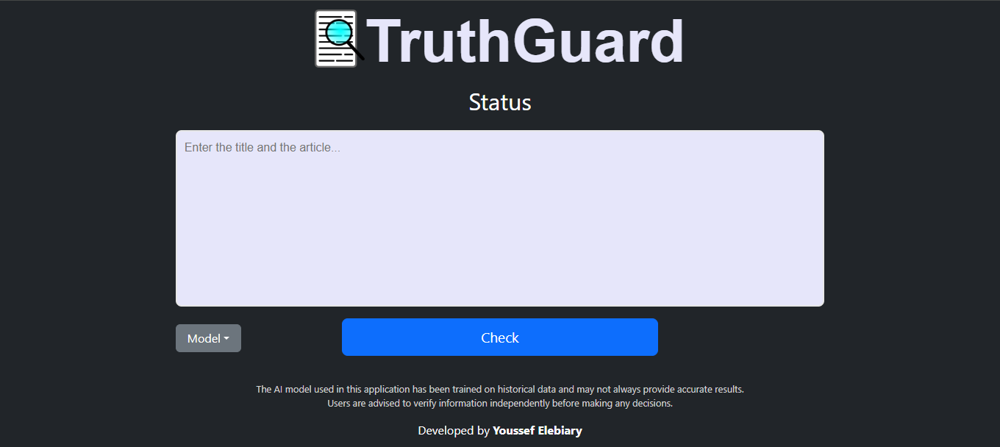

# TruthGuard
___


  


## Table of Contents
- [Description](#description)
- [Features](#features)
- [Installation](#installation)
- [Usage Instructions](#usage-instructions)
- [Technologies Used](#technologies-used)
- [Credits](#credits)
- [License](#license)

## Description
TruthGuard is a web application that uses machine learning algorithms (XGBoost and LightGBM) to detect fake news. <br>
Users can input text and select the desired model (standard or lite) and the prediction of the model will be displayed. <br>
For more details on the machine learning process, [click here](https://www.kaggle.com/code/youssefelebiary/truthguard). <br>
To access the preprocessed version of the dataset [click here](https://www.kaggle.com/datasets/youssefelebiary/fake-and-real-news-preprocessed).<br><br>

## Features
- **Fake News Detection**: &nbsp;Predicts whether a given text is fake or real.
- **Multiple Models**: &nbsp;Supports XGBoost and LightGBM.
- **User-Friendly Interface**: &nbsp;Simple and responsive web interface.
- **Preprocessing**: &nbsp;Automatic cleaning and preprocessing of the given text for accurate predictions. <br><br>

## Installation
1. Clone the repository:
    ```bash
    git clone https://github.com/YoussefElebiary/TruthGuard.git
    ```
2. Navigate to the project directory
    ```bash
    cd TruthGuard
    ```
3. Install the required dependencies:
    ```bash
    pip install -r requirements.txt
    ```
4. Run the Flask app:
    ```bash
    python app.py
    ```
5. Open your browser and visit `127.0.0.1:5000`
**Note**: If you want to access the app from another device, you can specify your device's IP address in the `app.run()` method, e.g., `app.run(host='192.0.0.10', port=8080)`.

## Usage Instructions
1. Copy and Paste the news article in the text box.
2. Select the model that will be used for prediction.
3. Click check and the prediction will appear clearly.

## Technologies Used
- **Python**: &nbsp;Core programming language, used to train the machine learning model and develop the back-end of the web application.
- **Flask**: &nbsp;Web framework for building the application.
- **XGBoost**: &nbsp;The standard machine learning model for detection.
- **LightGBM**: &nbsp;The lite machine learning model for detection.
- **Bootstrap**: &nbsp;Front-end CSS framework for styling and responsive designing.

## Credits
This web application was made by [**Youssef Elebiary**](https://github.com/YoussefElebiary/).
Connect with me on [LinkedIn](https://www.linkedin.com/in/youssef-elebiary/).

**Acknowledgments**:
- [NLTK](https://www.nltk.org/) for text preprocessing.
- [Bootstrap](https://getbootstrap.com/) for front-end design.
- [Flask](https://flask.palletsprojects.com/) for the web framework.

## License
This project is licensed under the MIT License. See the [LICENSE](LICENSE) file for details.
